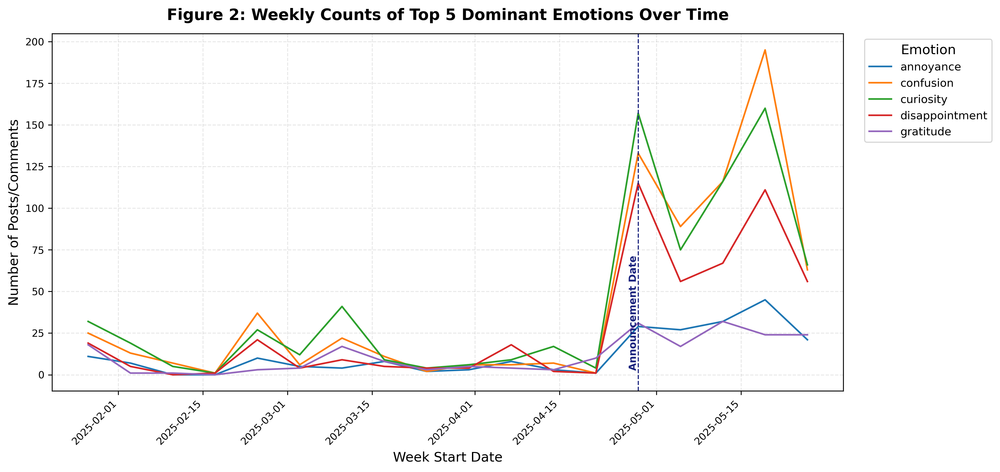
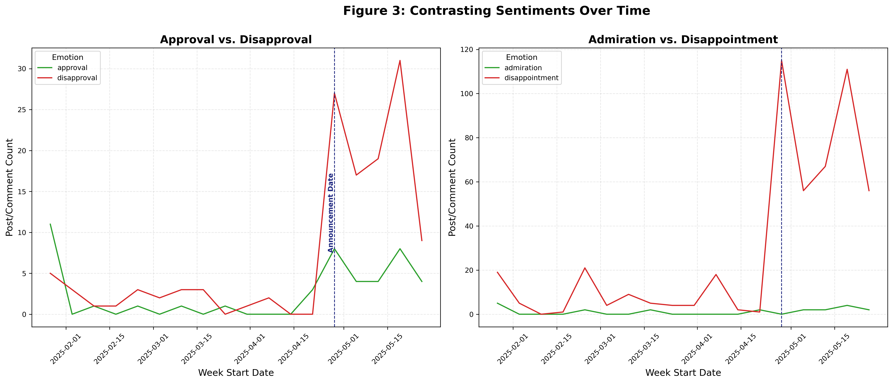
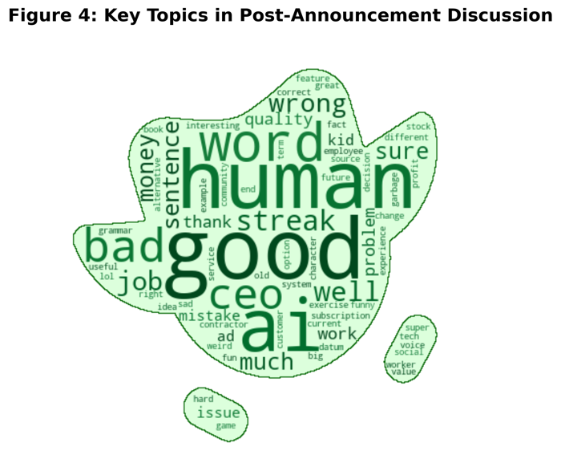

<h1 align="center">Duolingo's AI Stance: A Sentiment Analysis of Reddit's Response </h1>

[](https://github.com/MathRC/sentiment-analysis-duolingo)  
[](https://github.com/MathRC/sentiment-analysis-duolingo/blob/main/LICENSE)  
[](analysis/analysis.ipynb)

<p align="center"><em>Strategic shifts are common in business, but measuring audience reactions at scale demands advanced NLP techniques. This project analyzes 11,000+ Reddit posts/comments to uncover emotional patterns around Duolingo's move toward AI.</em></p>

---

## 🔍 Project Overview

On **April 28, 2025**, Duolingo surprised users by announcing its decision to become an **AI-first** company. By combining Reddit data with state-of-the-art NLP techniques, this project reveals:
- How public emotions evolved around the AI announcement.
- The dominant sentiments expressed during critical phases.
- Whether Duolingo's clarification successfully shifted the narrative.

As a data science enthusiast and longtime Duolingo user (with a 1,775-day streak to prove it!), this project gave me a chance to apply NLP to real-world reactions during a corporate pivot. It highlights the crucial role of data science in extracting valuable insights from unstructured text data.

---

## 📊 Key Findings

- **Emotional Surges**: The "AI-first" announcement triggered sharp spikes in curiosity, confusion, and disappointment on Reddit, far surpassing earlier peaks during the "Duo is dead" campaign.
- **Sustained Concern**: While Duolingo's CEO clarified the stance, negative sentiments persisted, indicating continued community concerns.
- **Core Concerns**: Discussions centered around the impact of AI on human jobs and contractors, financial motivations, and direct effects on user engagement.

---

## 📁 Repository Structure

```text
sentiment-analysis-duolingo/
├── analysis/
│   └── analysis.ipynb                            # Jupyter Notebook with full workflow
├── data/
│   ├── raw/
│   │   ├── duo_ai_raw.csv                        # Raw Reddit posts and comments
│   │   └── duo_mask.png                          # Duo-shaped mask for word cloud
│   └── processed/
│       ├── duo_ai_cleaned.csv                    # Text after preprocessing
│       ├── duo_ai_with_sentiment_raw.csv         # Sentiment scores (raw)
│       └── duo_ai_with_sentiment.csv             # Filtered sentiment labels
├── figures/
│   ├── Fig1_emotion_confidence_distribution.png  # Distribution of Emotion Confidence Scores
│   ├── Fig2_weekly_emotion_trends.png            # Weekly Counts of Dominant Emotions
│   ├── Fig3_opposing_emotions_trend.png          # Approval vs Disapproval & Admiration vs Disappointment
│   └── Fig4_wordcloud_spacy.png                  # Post-Announcement Word Cloud
├── .gitignore                                    # Git ignore rules
├── environment.yml                               # Environment specifications
├── LICENSE.txt                                   # Project license
└── README.md                                     # This README file
````

---

## 🛠️ Tech Stack  

- **Data Collection**: PRAW (Python Reddit API Wrapper)
- **Data Handling**: Pandas, NumPy, datetime
- **NLP & Text Processing**: Hugging Face Transformers (`joeddav/distilbert-base-uncased-go-emotions-student`), NLTK, SpaCy, emoji
- **Visualization**: Matplotlib, Seaborn, WordCloud, PIL

---

## 💻 How to Reproduce

1. **Clone the Repository**

    ```bash
    git clone https://github.com/MathRC/sentiment-analysis-duolingo.git
    cd sentiment-analysis-duolingo
    ```


2. **Set Up the Environment**

    ```bash
    conda env create -f environment.yml
    conda activate sentiment-analysis-Duolingo
    ```

    Install SpaCy and NLTK data:
    ```bash
    python -m spacy download en_core_web_sm
    python -c "import nltk; nltk.download('stopwords'); nltk.download('wordnet'); nltk.download('punkt')"
    ```


3. **Configure Reddit API Credentials**

    Create a `config.ini` with your Reddit API credentials in the project root:

    ```ini
    [reddit]
    client_id     = YOUR_CLIENT_ID
    client_secret = YOUR_CLIENT_SECRET
    username      = YOUR_REDDIT_USERNAME
    password      = YOUR_REDDIT_PASSWORD
    ```
    

4. **Run the Analysis**

    ```bash
    cd analysis
    jupyter notebook analysis.ipynb
    ```
    
    Follow the notebook to:

    * Collect data via PRAW
    * Preprocess text data
    * Perform sentiment analysis
    * Generate visualizations saved in `figures/`

---

## 📈 Visual Highlights

Here are some of the key visualizations from the project that illustrate the findings:



> Figure 2: Weekly counts of the top 5 dominant emotions expressed on Reddit over time, with the "AI-first" announcement date marked.

<br>



> Figure 3: Comparison of Approval vs. Disapproval and Admiration vs. Disappointment shows negative sentiment persisted even after the May 23 CEO clarification.

<br>



> Figure 4: Frequently discussed topics in the post-announcement period. Dominant themes like "human," "AI," and "job" reflect concerns about automation and workforce impact.

---

## 📝 License

This project is licensed under the MIT License. See `LICENSE.txt` for details.

---

## 🙏 Acknowledgments

A special thank you to Duolingo for continuing to make language learning fun and for providing such an interesting case study for sentiment analysis! And, of course, to the incredible open-source community for the powerful NLP and data science tools.

---

**🔗 Connect:** [LinkedIn](https://www.linkedin.com/in/matheus-chaud/) • [GitHub](https://github.com/MathRC)  
**📧 Email:** [matt25data@gmail.com](mailto:matt25data@gmail.com)


*✨ Open to collaboration and feedback!*  

---
